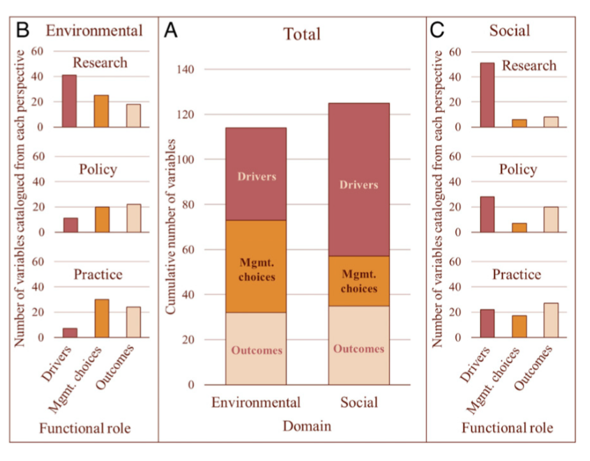
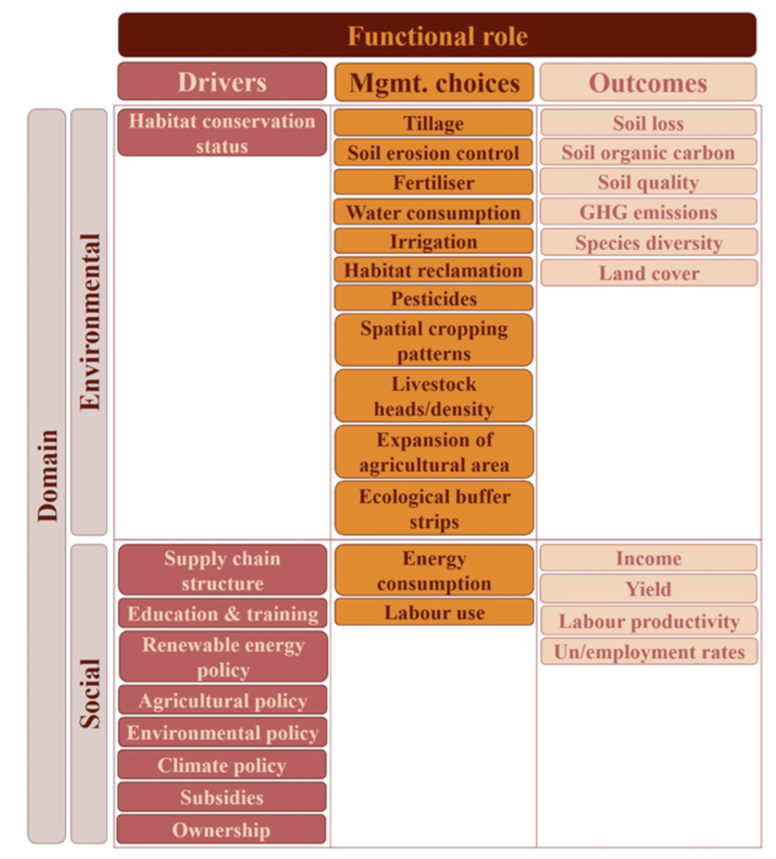
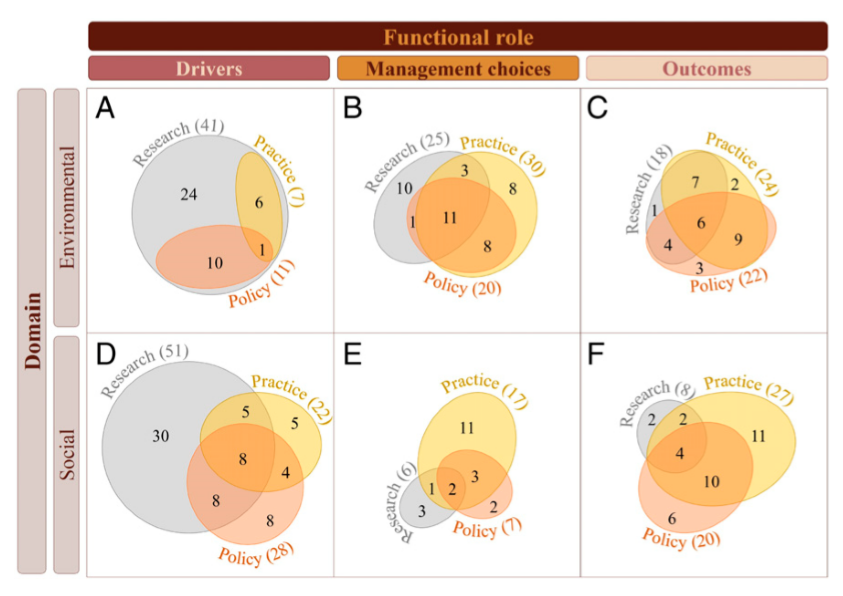

# 
 Aligning research with policy and practice for sustainable agriculturial land systems in Europe 
## 
 协同政策与实践实现农业系统可持续发展

## Abstract:

__background:__
three factors support the sustainable development, include

- research

- policy

- practice

__method:__

chosed 239 foctors of agricultural systems,include

- environmental factors

- social factors

- management choices

- outcomes

使用了239个因子，包括：环境,社会,农业产出，和管理措施。

69 research articles，SDGs and four EU policies, and seven agricultural sustainability assessment tools aimed at famers was selected to get data parameters. 
这些因子选取自69篇文章和7种农场主使用的可持续性评价工具，还有一些政策报告和可持续发展目标。

__result:__

this study recognize ___32 variables___ as key to agriculture system under three perspectives.
<bra>研究表明有 __32__ 种因子在三种视角下对农业都至关重要

the other 207 variables appear in only or two perspectives, we may overlook if evaluated from only one perspective.
<bra>过去的报道只从1个或者2给个角度研究的207因素可能高估其对可持续农业的影响。

this study identified ___4 approaches___ to agriculture and systems research in Europe that omit most of the variables considered important from policy and practice perspectives.
<bra>本研究甄别出4种农业系统的研究方法，但这写方法都忽略了从政策或者事件角度进行研究的重要性。

__conclusion:__

We posit that the four approaches reflect prevailing paradigms of research design and data analysis and suggest future research design should consider including the 32 shared variables as a starting point for more policy- and practicerelevant research.
<bra>这个研究认为通常所用的4个研究范式应该更多关注政策和实践。

 Our identification of shared priorities from different perspectives and attention to environmental and social domains and the functional role of system components provide a concrete basis to encourage codesigned and systems-based research approaches to guide agriculture’s contribution to the SDGs. 
<bra>本研究甄别出的32个因子为综合设计研究方法提供了坚实的基础

## introduction

agriculture has substantial negative impacts on four domain region.

- land, 
- biodeversity, 
- water 
- and the global climate.

research comprehensively evaluate relevant sustainability trade-offs in agriculture requeried both demands of policymakers and proctitioners.

___knowalge___

1. agriculture contributes between ___15% and and 25%___ of global greenhouse gas emissions
2. consumes __~70%__ of global freshwater withdrawals

239 parameters was classified into 3 grounps according to functional roles.

- drivers (affect agriculturen land use directly or indirectly)
- management choices
- outcomes (positive income, or negative environment effect)

__study content__

this study conduct a quantitative analysis of the domain and functional role of aricultural system variables from the three perspectives: research, policy, and practice.

__materils__

- 69 peer-reviewed articles,
- 5 ploicies
- 7 agricultural sustainability assessment tools

___conclusion___

this study agrgue that prevailing data and methodological paradigms, as well as the limited adoption of systems approaches, prevent current European agricultural land system research from more fully meeting the needs of policy and practice.

___novel points__

integrating perspectives from policy and practice, use systems approaches will support research better evaluates rade-offs and guides agriculture's contribution to sustainable development goals.

## Results

### 239 variables distribution

### 32 variables

### variable overlap

## Discussion
individul perspective limits the ability of research to achieve a holistic understanding and evaluation of trade-offs in agriculture.

<bra>present research approaches reflecting the prevailing paradigms,focus on commomlyu available land cover data, remote sensing, and GIS, without a deliberate consideration of needs of policymakers and practitioners in research design.

<bra>this study have gone beyond previous documentation and recommend that researchers expand the current limited inclusion of cocial outcomes in agriculture land systems research.

<bra>agricultural land systems researchers, policymakers, and practitioners in Europe currently share a small set of variables core to agricultural systems, which will play an important role in achieving the sustainable development goals.